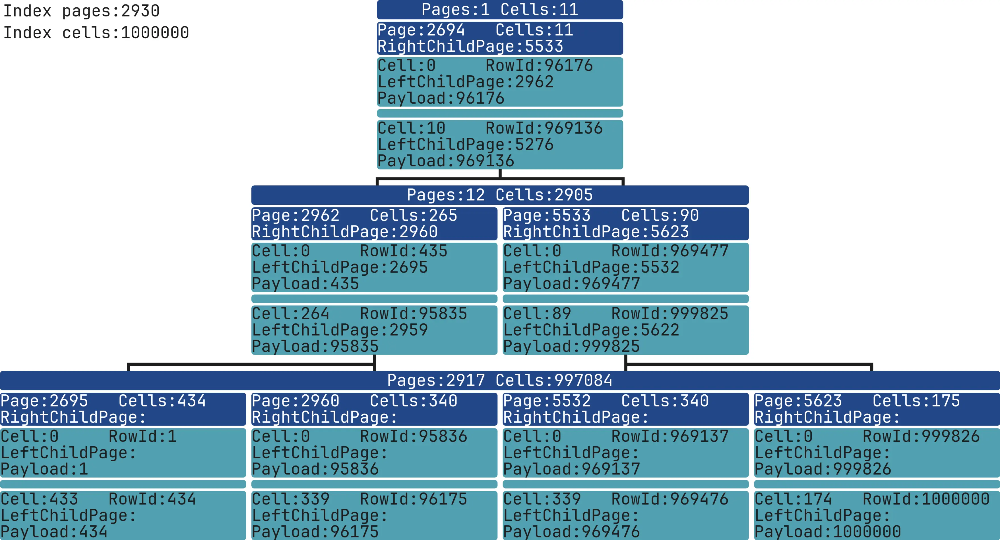

# SQLite3 indexes dump and visualization



## Usage
```bash
docker run -it --rm -v "$PWD":/app/data --platform linux/x86_64 mrsuh/sqlite-index bash

sh bin/dump-index.sh database.sqlite "SELECT * FROM table_test INDEXED BY idx WHERE column1 = 1;" dump-index.txt
php bin/console app:render-index --dumpIndexPath=dump-index.txt --outputImagePath=image-index.webp

sh bin/dump-search.sh database.sqlite "SELECT * FROM table_test INDEXED BY idx WHERE column1 = 1;" dump-search.txt
php bin/console app:render-search --dumpIndexPath=dump-index.txt --dumpSearchPath=dump-search.txt --outputImagePath=image-search.webp
```

## Tests
```bash
docker run -it --rm -v "$PWD":/app/data --platform linux/x86_64 mrsuh/sqlite-index bash
sh bin/test-index.sh
sh bin/test-search.sh
```

## Development
```bash
git clone git@github.com:sqlite/sqlite.git
cd sqlite
git checkout tags/version-3.46.0
patch -p0 --force < ../sqlite.patch
cd ..
mkdir build && cd build
make clean
../sqlite/configure CPPFLAGS="-DSQLITE_DEBUG -DSQLITE_ENABLE_EXPLAIN_COMMENTS -DSQLITE_ENABLE_TREETRACE -DSQLITE_ENABLE_WHERETRACE -DSQLITE_ENABLE_STMT_SCANSTATUS"
make sqlite3
git diff --no-prefix HEAD > sqlite.patch
```

```bash
docker build --platform linux/x86_64 -t mrsuh/sqlite-index .
```
